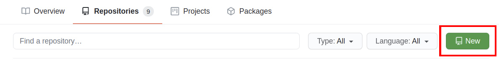
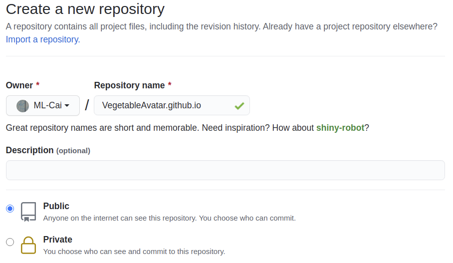
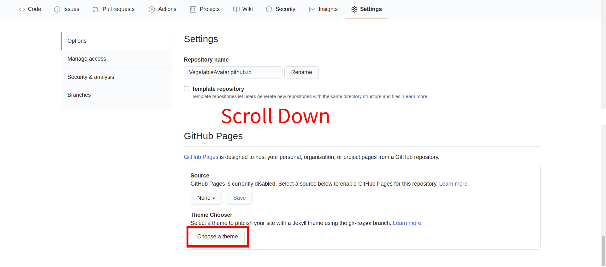
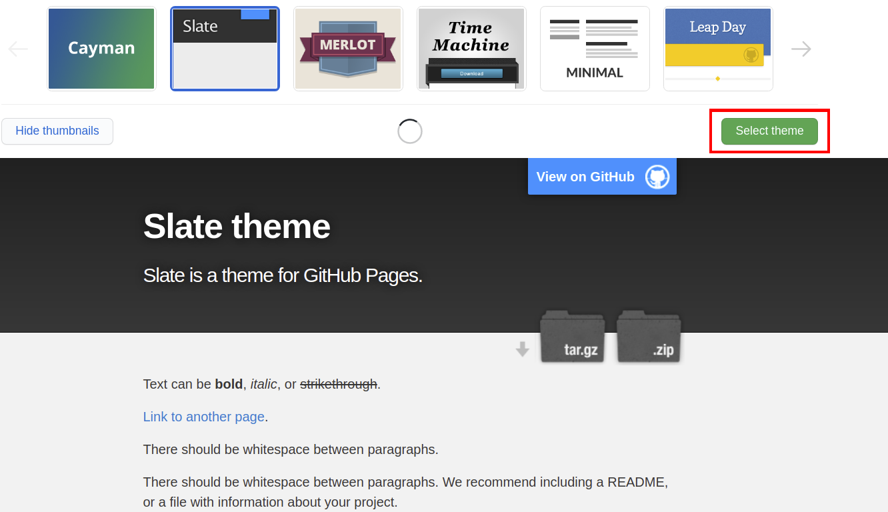
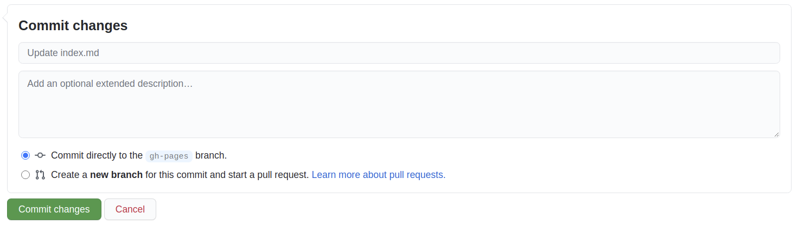
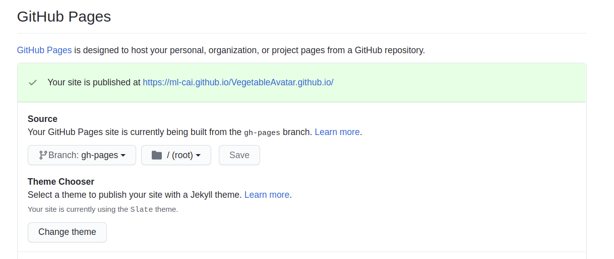
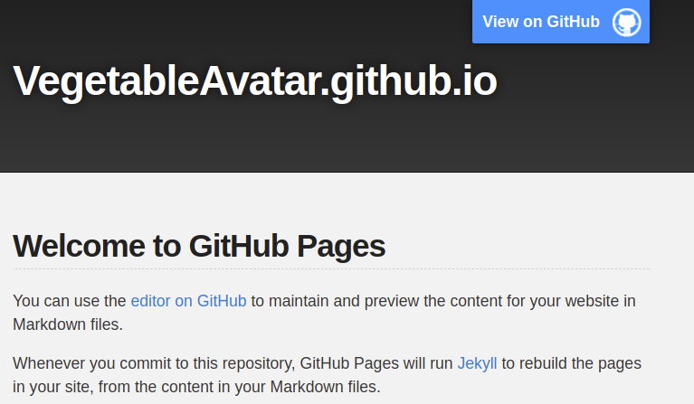

Create github.io
=======================
This note describes a simple flow to create your own webpage at github.io

- [Create github.io](#create-githubio)
    - [Create new repo for github.io](#create-new-repo-for-githubio)
    - [Setup default theme](#setup-default-theme)
    - [Test your page](#test-your-page)

### Create new repo for github.io
Create a new repository for github.io
Click "<b>create</b>" button at main page
    

And create new repository which name end with github.io, e.g. XXXXXXX.github.io
You could rename the XXXXXXX as desired nameing.
    

### Setup default theme
Once the repository created, please click "<b>Settings</b>" -> "<b>Options</b>" -- scroll down--> "<b>GitHub Pages</b>". Click "<b>Choose a theme</b>" to select default them of your webpage.

Next, select desired default theme for your webpage.
* Note : Your could chnage theme anytime or create your own theme by html, in this step, we just use default theme for demo.

GtiHub will ask to commit changes to your repo, just aggress it.

### Test your page
Once create successfully, you could find the page link at "Github Pages".

<b>Note</b> : click "<b>Settings</b>" at project -> "<b>Options</b>" -- scroll down--> "<b>GitHub Pages</b>".

Click the link, and test your page:
